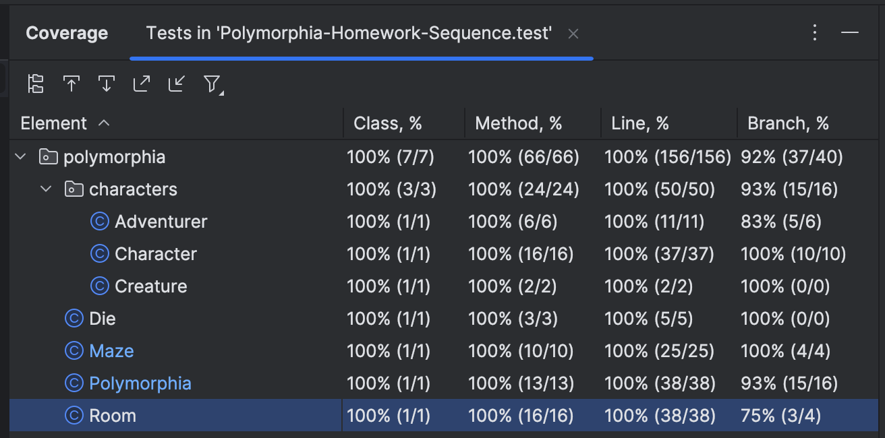

# Polymorphia Homework Sequence

Put all team members' names here:

    Names: Harrison Martin
    Java Version: 23
    Test Coverage Screenshot pasted below:
    
    ______________________________________
        Game Output pasted below (or linked):
        Starting play...
        Bilbo just died!

        Polymorphia MAZE: turn 1
        Northwest:


        Northeast:
            Guard(health: 3.0)

        Southwest:


        Southeast:
            Ogre(health: 3.0)
        The game ended after 1 turns.
        The creatures won. Boo! Left standing are: Guard(health: 3.0), Ogre(health: 3.0)
        Test ran to produce the output below: polymorphia.PolymorphiaTest.testGame
    ______________________________________

# CSCI 4448/5448 - Homework 3: Dependency Injection and Logging

**Value: 45 Points**

## Dependency Injection and Reducing Coupling

Whenever we use the _new_ operator in Java, we are tightly coupling our code to a specific implementation.
In this assignment need to eliminate all uses of the _new_ operator in your src/main/java classes. It is okay (actually
necessary) to use _new_ in your test classes.

Here are the exceptions to this rule:

* You can use _new_ in the Die class, which creates an instance of Random.
* You can use _new_ to create an instance of Random
* You can use _new_ in static methods on the same class:
* You can use _new_ to create collections like ArrayList, HashMap, etc.

```aiignore
public static Maze createMaze(int width, int height) {
    ...
    return new Maze..;
```

You will need to pass in dependencies to other classes instead of letting those other classes create its own
dependencies.
This way, the dependent object *must* code to the public interface of the class and cannot make any other assumptions.
This is known as Dependency Injection (DI). You can use either Constructor Injection (passing
arguments into the constructor of a class) or Setter Injection (creating objects outside the class and then calling a
setter
to set instance variable to a value. Do NOT use a DI framework like Spring or Google Guice for this assignment.

## Testing Reliability and Die Injection
---

In the current state of this code, all fighting is random. This is because the Die object used is random. This is
great for general game play, but makes testing problematic. We can't write a simple, definitive test. We've gotten
around it by enforcing a cost to fighting, win or lose, but that is not ideal. We can do better.

Our problem is that Characters are dependent upon a concrete class, Die, and this concrete class is random. In this
assignment, you'll fix this problem by using Dependency Injection to pass in a Die abstraction. What do I mean by a Die
abstraction? Well, it's a class that has a single method, roll(), that returns a random number between 1 and 6. This
is defined on the Die class:

```java
public int roll() {
  return rand.nextInt(sides) + 1;
}
```

Currently, the Die object is created inside the Character class. This is a violation of the Dependency Inversion
Principle and makes our code difficult to test. You need to solve this by injecting a Die object into the Character
class. Sometimes this will be a random Die, and sometimes (during some tests) it will be a non-random Die. From this
it should be clear that all sometimes the Die object will be created and injected into the Character object within a
test.

Remember that any new class needs to have a companion test class.

## Encapsulation

Each time you break encapsulation, we deduct points. How do you know you are
breaking encapsulation? One way is to investigate wherever you have a string of dotted method calls, like this:

    myIvar.getMyAtributes().get(2).getType() == “Creature”

Instead, just delegate the work to the top-level object:

    myIvar.isCreature()

A string of cascading messages doesn’t always break encapsulation, but it should signal you to take another
look at the code. It’s what’s known as a “code smell.” In some cases the object returned from each dotted
message is the same object (as in the Builder pattern we’ll see later in this course). In that case,
encapsulation is not broken.

Another significant benefit of replacing a string of dotted method calls is the opportunity to name the
action being performed and thereby write self-documenting code.

Another tip for figuring out if you are breaking encapsulation is that your code operates on internal data of a
different object, even if accessed via a getter. Whenever you spot this, ask yourself, “Could this operation be
moved inside that other object?” A simple example of this, that is relevant to Polymorphia, is the following:

    if (myCreature.getHealth() <= 0) {
        // do something
    }

This code is breaking encapsulation because it is operating on the internal data of the Creature object.
Instead, delegate the work to the Creature object:

    if (myCreature.isDead()) {
        // do something
    }

Use Inheritance to make your code DRY (Don’t Repeat Yourself), modular, and easy to understand. In this homework,
the only inheritance hierarchy will probably include the Adventurer, Creature and Guard classes.

## Logging

In this assignment we are going to eliminate all println statements from our mainline (src/main) code. We still want to
monitor
the state of the game however, so we're going to replace println statements with logging statements. Logging gives us
a level of indirection so that, without modifying our code, we could change the destination of our logging statements,
say, from the console to a file. This is handy when our programs are deployed and run on a server in the cloud.

    In general (there are always exceptions), we never want to have print statements in our mainline code.

You need to log the following events:

* State of the game after every turn
* Death of any Character, logging the name of the Character that died
* End of the game, logging who won

We’re going to use the _logback_ logging library. It is already set up in the build.gradle file. You can find
documentation for logback here: https://logback.qos.ch/manual/index.html. I've included a logback.xml file in the
resources directory that configures logging to the console. You can modify this file if you want to change the logging
format or the logging level. The default logging level is DEBUG, which means that all logging statements will be printed
(technically, there is a TRACE level, but I've never used that and they are only printed with the logging level at
TRACE).

An example of how to use logback is included in the Polymorphia class. At the top of
each class that uses logging, you'll see a line like this:

```java
private static final Logger logger = LoggerFactory.getLogger(Polymorphia.class);
```

This line creates a logger for the class.
A common mistake here is to use the wrong Logger class. You should use the Logger class from the
logback library (org.slf4j.Logger), not the Logger class from the java.util.logging library. Make
sure you have this import statement at the top of the class:

```java
import org.slf4j.Logger;
```

Another common mistake is to use the wrong logger name. The logger name should be the fully qualified name of the
class. This happens mostly when you copy and paste the code from one class to another.

Now that we have defined a logger, we can use it like this:

```java
logger.info("The game ended after {} turns.",turnCount);
```

where the method _info_ is used to log an informational message. There are other logging levels, including
_debug_, _warn_, and _error_.

---

Do not change the spirit of any of the existing tests. You can add code to create objects and inject them into other
objects, but do not change what the tests are testing for. If you break
a test, you need to get it working again. Don't just delete it, change it,
or disabled it. You should be adding additional tests.

In this homework you'll expand the type of maze/cave within which the game is played.
In **addition** to the 4-room maze from the previous homework:

```
[Room 1]----[Room 2]
    |           |    
    |           |    
[Room 3]----[Room 4]
```

You'll add the ability to play in a cave with a 3x3 layout of rooms like this:

```
[Room NW]----[Room N]----[Room NE]
   |             |           |    
   |             |           |    
[Room W] ----[Room C]----[Room E]
   |             |           |    
   |             |           |    
[Room SW]----[Room S]----[Room SE]

```

Make sure to include tests against both maze layouts.

It is possible to write a method that will create a grid of rooms of any size, given the dimensions. This might be
handy, but that is not required for this assignment.

Also, extend the game to handle a list of Characters to be randomly placed in random rooms in the maze.
Create a few different versions of your game (different mazes, different number of Adventurers, Creatures, and
Guards) via different tests. Write tests like:

```java

@Test
public void test2x2GameWithTwoAdventurersAndFiveCreatures() {...}

public void test3x3GameWithThreeAdventurersAndFourCreatures() {...}
...
```

## Rubric

- 20 points for correct use of dependency injection to eliminate all uses of the _new_ operator and coupling to concrete
  classes (besides noted exceptions)
- 5 points for Die hierarchy and correct use of inheritance.
- 2 points for new Die test(s).
- 4 points for Die injection.
- 10 points for correct use of logging to eliminate all println statements.
- 1 point each for a comment in the code describing an example of:
    - Encapsulation / Information Hiding
    - Dependency Injection
    - Polymorphism
    - Inheritance

## Deductions

Here I list all the ways you can lose points on any programming assignment in this class, going forward.
You will lose 1 point for each of the following, up to a maximum of 10 points. Use this as a checklist before
submitting your code.

- [ ] Magic numbers or strings
- [ ] Poorly named variables, methods, classes, interfaces, etc.
- [ ] Poorly formatted code
- [ ] Breaking encapsulation (you might need to delete or modify a method to fix this. Pay special attention to
  the access modifiers of your methods and variables)
- [ ] Missing or incomplete README.md file (including missing names, Java version, test coverage screenshot, etc.)
- [ ] Missing or incomplete game output files (2 runs of the game)
- [ ] Each method that isn't covered by a test
- [ ] Variables/Methods of the Wrong Type -- instance vs class (static)
- [ ] Each class that isn't covered by a test

---

- [ ] Each method that is larger than 20 lines, if it tries to do more than one thing
- [ ] Each use of System.out.println in your main code – replace it with logging statements.
- [ ] Include citations (URLs or AI agent) of any code from external sources.

Do not change the spirit of any of the existing tests. You can add code to create objects and inject them into other
objects, but do not change the existing tests in any other way. You can add new tests if you want.

For all code submissions, the following will be required:

* The project builds with Gradle and runs successfully
* All BDD tests pass
* Adding any assumptions about your implementation in this README.md file. If anything
  isn't specified to your satisfaction in the homework description, that means you
  are free to decide for yourself. Just make sure to document your assumptions here.

This is a group assignment, as will be all the remaining homework assignments.
You will submit a URL to your GitHub Classroom repository.

# Submission and Grading

The submission will be a URL to the GitHub repository. The repository should contain well-structured OO Java
code for the Polymorphia simulation, the two captured text files with the program results requested,
and a README file that has the names of the team members, the Java version,
and any other comments on the work – including documenting any assumptions or interpretations of the problem.
Only one URL submission is required per team.

## Github Guidelines

All code submissions for this course will be managed through GitHub Classroom.
Since Homework 3 is a team assignment, only one repository submission is required per team. Hence, please do the
following:

* TEAM-MEMBER-1 generates the repository.
* TEAM-MEMBER-1 adds TEAM-MEMBER-2 as a collaborator with write permissions.

ONLY ONE of the team members submits the repository link in Canvas. You'll both get credit for the submission.

Please do not make the repositories public since this violates the Honor Code.
Please note that repositories not established using the GitHub Classroom link will not be considered valid for
submission.

Please contact the class staff if you encounter technical difficulties or have questions about the setup process.

## Overall Project Guidelines

Assignments will be accepted late for one day only with a penalty of 10%.
After that, assignments will be given a 0 and will not be graded.

Use office hours, e-mail, or Piazza to reach the class staff regarding homework/project questions or if you have issues
completing the assignment.

# Homework Sequence

This sequence of homework assignments is designed to
give you practice in OO design and implementation using
the four pillars of OO:

* Abstraction
* Polymorphism
* Inheritance
* Encapsulation

Along with the SOLID principles:

* Single Responsibility Principle
* Open for Extension; Closed for Modifications
* Liskov Substitution Principle (IS-A relationship)
* Interface Fidelity Principle
* Dependency Injection

Plus:

* DRY (Don't Repeat Yourself)
* KISS (Keep It Simple, Stupid)
* YAGNI (You Ain't Gonna Need It)
